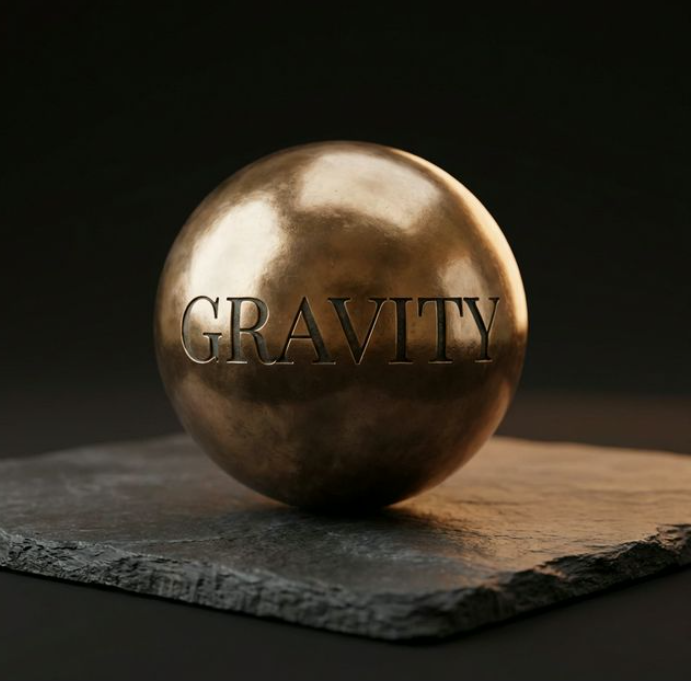

# Gravity. — Design Guidelines

> Generated from the Nano Banana Pro brand identity deck.
> This is the single source of truth for all UI decisions.
> **Every component, page, and interaction must conform to these rules.**

---

## 1. Brand Philosophy

**Aesthetic: Grounded Luxury**

> Research shows that natural backgrounds reduce cognitive load.
> Gravity rejects the neon urgency of notifications.
> We adopt an identity that is restorative, architectural, and substantial.
> We are not moving fast and breaking things. We are building things that last.

**Core principles:**
- **Restorative** — The UI should feel calming, not demanding. No neon, no urgency colours for normal states.
- **Architectural** — Layouts are structural and intentional. Generous white space, clear hierarchy.
- **Substantial** — Elements feel weighty and real. Copper glows, shadows have depth, buttons feel tactile.

---

## 2. The Restorative Palette

The palette has TWO tiers with distinct roles.

> **Decision (March 2026):** Deep Space Indigo was part of the original brand deck for
> presentation slides and print materials. For the web/mobile app, we skip Indigo and let
> Warm Sand + Kinetic Copper carry the identity. The warm palette IS the app experience —
> restorative and calming, not dark and heavy.

### Warm Sand — Primary Surface. Humanity & Restoration.
```
--color-bg-warm:       #FAF7F2   (page backgrounds)
--color-sand:          #E8E0D4   (borders, dividers)
--color-sand-light:    #F0EBE3   (hover states, subtle fills)
--color-mist:          #F5F0E8   (card backgrounds, input backgrounds)
--color-bg-card:       #FFFFFF   (elevated cards only)
```
- **Use for:** All page backgrounds, card surfaces, input fields, the warm canvas everything sits on
- The app currently uses this tier correctly

### Kinetic Copper — Accent. The Spark of Connection.
```
--color-copper:        #B87333   (primary accent)
--color-copper-dark:   #8B5A2B   (hover/pressed states)
--color-copper-light:  #D4956A   (secondary accent, progress bars)
--color-gold:          #D4AF37   (special highlights, match percentages)
```
- **Use for:** CTA buttons, active states, progress indicators, selected tags, links, the radar sweep, connection actions
- Copper is the ACCENT, not the primary. It should spark, not dominate.

### Semantic colours
```
--color-success:       #3D8B5F   (connected, active, online)
--color-error:         #C24B3B   (delete, reject, destructive)
--color-steel:         #4A4543   (secondary text)
--color-steel-light:   #7A7572   (tertiary text, placeholders)
```

### Palette hierarchy rule
> **Sand breathes. Copper sparks.**
>
> Sand should be the dominant surface colour (60-70% of any screen).
> Copper is reserved for actions, highlights, and interactive elements.
> If a page feels busy or urgent, there's too much Copper.
> Use white cards and mist backgrounds to create depth within the warm canvas.

---

## 3. Typography

### Heritage Meets Utility

**Headlines: Playfair Display** — Serif
- Signals: Heritage, Premium, Storytelling
- Use for: Page titles, card names, brand text ("Gravity."), section headers, button labels on primary CTAs
- Weights: 400 (italic for taglines), 700 (bold for headings)
- Always use with tight tracking for display sizes

**Body: Inter** — Sans-serif
- Signals: Utility, Data, Precision
- Use for: Body text, labels, metadata, descriptions, input text, secondary buttons
- Weights: 400, 500, 600, 700

### Type scale
| Element | Font | Size | Weight | Case |
|---------|------|------|--------|------|
| Page title | Playfair | 28-32px | 700 | Sentence |
| Section header | Playfair | 18-22px | 700 | Sentence |
| Card name | Playfair | 15-16px | 700 | Sentence |
| Brand mark "Gravity." | Playfair | 20-24px | 700 | Sentence + period |
| Tagline | Playfair | 14-16px | 400 italic | Sentence |
| Body text | Inter | 14-15px | 400 | Sentence |
| Section label | Inter | 11px | 700 | UPPERCASE, tracking 0.12em |
| Button primary | Playfair | 11-13px | 700 | UPPERCASE, tracking 0.08em |
| Button secondary | Inter | 11-12px | 600 | UPPERCASE, tracking 0.05em |
| Metadata/caption | Inter | 11-12px | 500 | Sentence |
| Badge/tag | Inter | 11px | 500 | Sentence |

### Key typography rules
- The brand name is always **"Gravity."** with a period
- Tagline is always **"Proximity creates opportunity."** in Playfair italic
- Section labels (e.g., "NEARBY PROFESSIONALS", "CORE INTERESTS") are always Inter uppercase with wide tracking
- Never use all-caps Playfair for body text

---

## 4. Logo



- Bronze/copper metallic sphere with "GRAVITY" engraved, resting on dark slate
- File: `src/assets/logo.png`
- **Usage rules:**
  - Landing page: Large (144-176px), centered, with subtle copper glow shadow
  - Navbar: Small (32px), rounded, as a home link
  - Always use `object-contain` / `object-cover` with `rounded-full` at small sizes
  - Drop shadow should reference copper: `drop-shadow-[0_20px_60px_rgba(184,115,51,0.35)]`
  - On the landing page, the logo sits inside a circular frame with a subtle copper ring border

---

## 5. Component Specifications

### 5.1 Navigation

**Reference:** image005, image006 — Bottom tab bar

The Nano Banana design uses a **bottom tab bar**, not a top navbar, for authenticated views:

| Tab | Icon | Label |
|-----|------|-------|
| Home (Radar) | House | Home |
| Network | People group | Network |
| Messages | Chat bubble | Messages |
| Profile | Person | Profile |

**Top bar (authenticated):** "Gravity." brand mark on the left, status badge ("ACTIVE" with green dot) on the right. Minimal — no navigation links in the top bar.

**Top bar (unauthenticated/onboarding):** Back arrow on the left, "Gravity." in copper on the right.

### 5.2 Buttons

**Primary CTA:**
- Background: `--color-copper` (#B87333)
- Text: White, Playfair Display 700, uppercase, tracking 0.08em
- Border-radius: Full pill (`9999px`)
- Full-width on mobile, generous padding (14-16px vertical)
- Shadow: `--shadow-md`
- Hover: `--color-copper-dark`, lift -1px, `--shadow-lg`
- Example: "Create Your Account", "Send Connection Request", "Get Magic Link"

**Secondary CTA:**
- Background: Transparent
- Border: 1.5px solid `--color-sand`
- Text: `--color-text-primary`, Inter 600, uppercase
- Border-radius: Full pill
- Hover: White background, border shifts to `--color-copper-light`
- Example: "Log In", "Close", "Pass"

**Tertiary/Ghost:**
- No background, no border
- Text: `--color-steel-light`, Inter 600, uppercase, wide tracking
- Hover: `--color-copper`
- Example: "Skip to Demo"

### 5.3 Cards

**Profile card (radar list item):**
- Background: white `--color-bg-card`
- Border: 1px `--color-sand`
- Border-radius: 16px (`--radius-xl`)
- Layout: Avatar (36-40px circle) | Name (Playfair 700) + Role (Inter 400, steel) | Distance (copper) + Match % (copper/gold badge)
- Shadow: `--shadow-sm`, hover `--shadow-md`

**Profile detail modal:**
- Slides up or overlays as a rounded card
- Avatar top-left (64px, rounded-lg with 4px border-radius, NOT circle)
- Name in Playfair 700
- Distance in copper, top-right
- "INTERESTS" label uppercase Inter
- Interest tags as outline pills
- Full-width copper "Send Connection Request" button at bottom

**Stat cards (profile page):**
- Side-by-side pair
- Background: `--color-mist`
- Border: 1px `--color-sand`
- Large number in Playfair 700, copper colour
- Label below in Inter uppercase, steel

### 5.4 Tags / Interest Chips

**Unselected (suggestion):**
- Background: transparent or `--color-mist`
- Border: 1px solid `--color-sand`
- Text: `--color-text-primary`, Inter 500, 11px
- Prefix: `+` symbol
- Border-radius: full pill

**Selected:**
- Background: `--color-copper`
- Border: none
- Text: white, Inter 600
- Prefix: checkmark
- Border-radius: full pill

**Display (profile view):**
- Background: `--color-mist`
- Border: 1px solid `--color-sand`
- Text: `--color-text-primary`, Inter 500
- No prefix
- Border-radius: full pill

### 5.5 Input Fields

- Background: `--color-bg-card` (white)
- Border: 1.5px solid `--color-sand`
- Border-radius: `--radius-md` (1rem)
- Padding: 14px 18px
- Font: Inter 400, 15px
- Placeholder: `--color-steel-light` at 60% opacity
- Focus: border `--color-copper`, box-shadow `0 0 0 3px rgba(184,115,51,0.1)`

### 5.6 Progress Bar (Onboarding)

- Track: `--color-sand`
- Fill: `--color-copper`
- Height: 3-4px
- Border-radius: full
- Label above: "STEP X OF 3" in Inter 700 uppercase, `--color-steel`

### 5.7 Chat Bubbles

**Sent (own messages):**
- Background: `--color-copper`
- Text: white, Inter 400, 14px
- Border-radius: 16px, bottom-right: 4px
- Timestamp below in Inter 400, 10px, `--color-steel-light`

**Received:**
- Background: `--color-bg-card` (white)
- Border: 1px `--color-sand`
- Text: `--color-text-primary`
- Border-radius: 16px, bottom-left: 4px
- Timestamp below

**Input bar:**
- Sticky bottom
- Location pin icon (left), text input (centre), send arrow button (right, copper)
- Background: `--color-bg-warm`
- Border-top: 1px `--color-sand`

### 5.8 Status Badge

**"ACTIVE" presence badge:**
- Background: white `--color-bg-card`
- Border: 1px `--color-sand`
- Border-radius: full pill
- Content: green dot (6px, `--color-success`, pulsing animation) + "ACTIVE" in Inter 600 uppercase, `--color-copper`
- Position: Top-right of radar page, next to brand mark

### 5.9 Confirmation Modal

- Rounded card overlay (border-radius 24px)
- Top section: Light green/cream background
- Green circle with white checkmark
- Title: Playfair 700, "Connection Request Sent"
- Subtitle: Inter 400, `--color-steel`
- "Close" button: secondary style

---

## 6. Page-by-Page Specifications

### 6.1 Landing Page
**Reference:** image001

- Full-screen, centred vertically
- Background: `--color-bg-warm`
- Logo: 120-140px, inside a circular frame with copper ring (2px border, `--color-copper` at 30% opacity), subtle glow
- "Gravity." in Playfair 700, ~48px
- "Proximity creates Opportunity." in Playfair 400 italic, copper colour
- Two full-width buttons stacked: "Create Your Account" (primary), "Log In" (secondary)
- Optional: "Skip to Demo" as ghost text link below

### 6.2 Onboarding (3 Steps)
**Reference:** image002, image003, image004

**Layout (all steps):**
- Top bar: Back arrow (left), "Gravity." in copper (right)
- Progress: "STEP X OF 3" label + copper progress bar
- Page title: Playfair 700, 28px

**Step 1 — "Tell us about yourself":**
- Avatar upload circle (80px) with camera icon overlay
- Fields: Full Name, Headline (profession), Company
- All fields use `.input-field` styling

**Step 2 — "Interests":**
- Custom interest input with "Add" button (copper, small)
- "SUGGESTIONS" label
- Grid of suggestion chips (unselected = outline + prefix, selected = copper fill + checkmark)
- "SELECTED (X/10)" counter
- Selected tags displayed as removable pills below

**Step 3 — "Intent":**
- "Who are you looking to connect with?" subtitle
- Textarea (large, multi-line input)
- Info note with icon: "Sharing your distance enables serendipity. Your exact location is never shared."

### 6.3 Radar (Home)
**Reference:** image005, image008

**Top bar:** "Gravity." left, "ACTIVE" badge right
**Radar visualisation:**
- Concentric rings (3) on warm cream, subtle copper tint
- Copper sweep animation (conic gradient, rotating)
- User pips: Small copper dots, YOUR position = centre dot (larger, darker)
- Background: Same warm cream as page

**Below radar:**
- "NEARBY PROFESSIONALS" section label (left), "X Active" count (right, copper)
- List of profile cards:
  - Avatar (40px, rounded with slight border-radius) | Name (Playfair 700) + Role (Inter, steel) | Distance + Match %
  - Distance in metres, copper colour
  - Match % in a copper/gold pill badge
  - If pending: "AWAITING REPLY" label in uppercase Inter, copper

**Tapping a card:** Opens profile detail modal (see 5.3)

### 6.4 Profile Page
**Reference:** image010, image011

- Copper banner header (full-width, ~80px, `--color-copper` background)
- Avatar (72px, rounded-lg) overlapping banner, centred
- Name: Playfair 700, centred
- Role: Inter 400, steel, centred
- Stats row: Two stat cards side by side ("NETWORK" count, "VISIBILITY" count)
- Sections:
  - "INTERESTS & INTENT" (or "LEGACY ASSETS") — section label uppercase
  - "EDIT" button (copper text, outlined small button) top-right of section
  - "CORE INTERESTS" sub-label + tag pills
  - "PROFESSIONAL INTENT" sub-label + quoted italic text
- "App Settings" row (gear icon, arrow right)
- "Privacy Settings" row (lock icon, arrow right)
- "GDPR Compliance" row (shield icon, arrow right)
- "Logout" at bottom (red/error text)

### 6.5 Chat Page
**Reference:** image009

- Top bar with back arrow + contact avatar + name
- Message list: Sent (copper, right-aligned), Received (white, left-aligned)
- Timestamps below each bubble group
- Input bar: sticky bottom with location icon, text field, copper send button
- Background: `--color-bg-warm`

### 6.6 Connections / Network
- Section tabs or filters: "PENDING", "CONNECTED"
- Pending: Notification cards with accept/reject buttons
- Connected: List with "Message" action button

---

## 7. Animation & Motion

**Philosophy:** Subtle, purposeful, never gratuitous. Motion should feel like gravity — smooth deceleration.

**Easing:** `cubic-bezier(0.22, 1, 0.36, 1)` — the standard ease for all transitions

| Animation | Duration | Use |
|-----------|----------|-----|
| fadeIn | 0.6s | Page content appearing |
| fadeInUp | 0.5s | Cards entering viewport |
| slideUp | 0.4s | Modals, bottom sheets |
| radarPulse | 3.5s infinite | Radar rings pulsing outward |
| radarSweep | 5s linear infinite | Radar sweep arm rotation |
| gentlePulse | 2s infinite | Status dots, notification badges |

**Rules:**
- Never animate more than 3 elements simultaneously
- Stagger sequential items by 0.1s
- All hover transitions: 0.2s ease
- No bouncing, no overshoot — gravity pulls, it doesn't bounce

---

## 8. Spacing & Layout

**Container:** Max-width 480px for mobile-first views, centred
**Page padding:** 24px horizontal, 20px vertical
**Card padding:** 16-20px
**Section gaps:** 24-32px between sections
**Element gaps within cards:** 8-12px

**Border radius scale:**
| Token | Value | Use |
|-------|-------|-----|
| `--radius-sm` | 12px | Small tags, badges |
| `--radius-md` | 16px | Input fields, small cards |
| `--radius-lg` | 24px | Cards, modals |
| `--radius-xl` | 32px | Large modals, sheets |
| `--radius-full` | 9999px | Buttons, pills, avatars |

---

## 9. Shadows

```
--shadow-sm:      0 1px 3px rgba(0,0,0,0.04), 0 1px 2px rgba(0,0,0,0.06)
--shadow-md:      0 4px 12px rgba(0,0,0,0.06), 0 1px 3px rgba(0,0,0,0.04)
--shadow-lg:      0 12px 32px rgba(0,0,0,0.08), 0 4px 8px rgba(0,0,0,0.04)
--shadow-premium: 0 20px 40px -12px rgba(184,115,51,0.15), 0 8px 16px -8px rgba(0,0,0,0.06)
```

- Cards at rest: `--shadow-sm`
- Cards on hover: `--shadow-md`
- Modals/elevated: `--shadow-lg`
- Logo/hero elements: `--shadow-premium`

---

## 10. Iconography

- Style: Feather/Lucide — thin stroke (1.5-2px), rounded caps and joins
- Size: 16-20px for inline, 24px for standalone
- Colour: Inherit from parent (usually `--color-steel` or `--color-copper`)
- Never use filled icons — always outline/stroke

---

## 11. Implementation Gap Analysis

### Currently correct:
- Font pairing (Playfair + Inter)
- Copper accent colour
- Warm sand background
- Card styling (white, sand border, rounded)
- Input field styling
- Button pill shapes
- Radar concept with concentric rings

### Resolved (March 2026):

| Issue | Resolution |
|-------|-----------|
| ~~Deep Space Indigo~~ | Intentionally skipped for app — reserved for print/slides |
| **Navigation** | Bottom tab bar (Home/Network/Messages/Profile) implemented |
| **Top bar (auth)** | Minimal: "Gravity." left + admin icon right |
| **Onboarding** | 3-step flow with progress bar implemented |
| **Interest selection** | Suggestion chips with +/checkmark toggle implemented |
| **Profile page** | Copper banner, stats row, structured sections implemented |
| **Radar list** | Distance + match % badges + "AWAITING REPLY" states implemented |
| **"ACTIVE" badge** | Green dot + "ACTIVE" pill on radar page implemented |
| **Confirmation modal** | Green check modal for connection requests implemented |
| **Chat bubbles** | Copper sent, white received, timestamps below groups |
| **Admin access** | Icon in top bar, visible only for ADMIN_EMAILS |

---

## 12. Asset Reference

All Nano Banana Pro mockups are stored in the `design/` folder:

| File | Content |
|------|---------|
| `gravity-logo.png` | Brand logo — bronze sphere on slate |
| `image001.png` | Landing page mockup |
| `image002.png` | Onboarding Step 1 — Profile |
| `image003.png` | Onboarding Step 2 — Interests |
| `image004.png` | Onboarding Step 3 — Intent |
| `image005.png` | Radar page (default state) |
| `image006.png` | Profile detail modal + bottom tabs |
| `image007.png` | Connection request sent confirmation |
| `image008.png` | Radar page (with "awaiting reply" state) |
| `image009.png` | Chat page |
| `image010.png` | Profile page (top half) |
| `image011.png` | Profile page (bottom half — settings) |

---

## 13. Quick Reference: CSS Token Map

When implementing, use these CSS custom properties (defined in `src/index.css`):

```css
/* All tokens defined in src/index.css */
--color-primary:       #B87333;  /* Copper accent */
--color-primary-light: #D4956A;
--color-primary-dark:  #8B5A2B;
--color-accent:        #D4AF37;  /* Gold highlight */
--color-bg-warm:       #FAF7F2;  /* Warm sand background */
--color-bg-card:       #FFFFFF;
--color-sand:          #E8E0D4;
--color-mist:          #F5F0E8;
--color-text-primary:  #2A2522;
--color-text-header:   #1A1714;
--color-text-secondary:#6B6560;
--color-steel:         #4A4543;
--color-steel-light:   #7A7572;
--color-success:       #3D8B5F;
--color-error:         #C24B3B;
```

---

*Last updated from Nano Banana Pro brand deck, March 2026.*
*When in doubt, refer to the mockup images in `design/` — they are the ground truth.*
